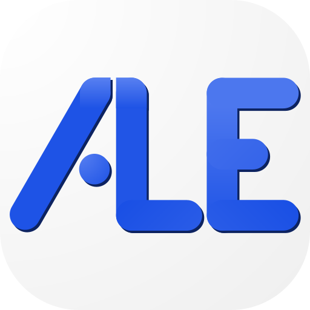

<!-- PROJECT LOGO -->
<br />
<p align="center">
  <a href="https://github.com/JOTSR/ALE/">
    
  </a>

  <h3 align="center">ALE: ABC Licence &Eacute;talonnage</h3>

  <p align="center">
    A tool for calibrate the JUNO project's ABC card.
  </p>
</p>

<!-- GETTING STARTED -->

## Getting Started

This is instructions on setting up this project locally.
To get a local copy up and running follow these simple example steps.

### Prerequisites

Install at least [deno v1.10](https://deno.land/)

-   check for updates
    ```sh
    deno upgrade
    ```
For local use get:
-   [sass](https://sass-lang.com/)
-   [esbuild](https://esbuild.github.io/)
-   [Velociraptor](https://deno.land/x/velociraptor@1.0.0-beta.18)
    ```sh
    deno install -qA -n vr https://deno.land/x/velociraptor@1.0.0-beta.18/cli.ts
    ```

### Installation

<!-- 1. Run directly
   ```sh
   deno run https://github.com/JOTSR/ALE/main.ts
   ```
    Or -->

1. Clone the repo
    ```sh
    git clone https://github.com/JOTSR/ALE.git
    ```
1. ```sh
   vr run dev
   ```

<!-- CONTRIBUTING -->

## Contributing

Follow the [conventinal commits specification](https://www.conventionalcommits.org/en/v1.0.0/), for more details check [Workflow Gitflow](https://www.atlassian.com/fr/git/tutorials/comparing-workflows/gitflow-workflow)

1. Fork the Project
2. Create your Feature Branch (`git checkout -b feature/YourFeature`)
3. Commit your Changes (`git commit -m 'Add some YourFeature'`)
4. Push to the Branch (`git push origin feature/YourFeature`)
5. Open a Pull Request
